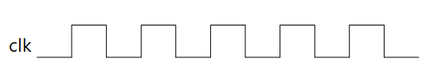

# 时钟树知识

## 1、什么是时钟

答：简单来说，时钟是具有周期性的脉冲信号，最常用的是占空比50%的方波。

注意：**时钟是单片机的脉搏，搞懂时钟走向及关系，对单片机使用至关重要！**

## 2、认识时钟树(以STM32F1的为例子)

答：

### **时钟树具体图：**

.png)

### **时钟源介绍：**

|     **时钟源名称**      | **频率**  | **材料**  |  **用途**  |
| :---------------------: | :-------: | :-------: | :--------: |
| **高速外部振荡器(HSE)** |  4~16MHz  | 晶体/陶瓷 | SYSCLK/RTC |
| **低速外部振荡器(LSE)** | 32.768KHz | 晶体/陶瓷 |    RTC     |
| **高速内部振荡器(HSI)** |   8MHz    |    RC     |   SYSCLK   |
| **低速内部振荡器(LSI)** |   40KHz   |    RC     |  RTC/IWDG  |

- H：high         高

- L：low           低

- S：speed      速度

- I：internal     内部

- E：external   外部

    

### **时钟树中的CSS和FCLK的作用：**

|        **符号**        |                **作用**                 |
| :--------------------: | :-------------------------------------: |
| **时钟安全系统(CSS)**  | 如果HSE启动失败，切换到HSI，可进NMI中断 |
| **自由运行时钟(FCLK)** | 用于采样中断和调试模块计时，休眠仍有效  |

### 时钟树简图：

.png)

.png)