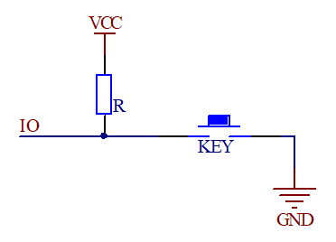
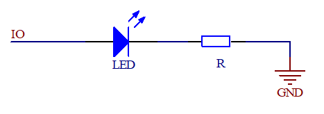

# GPIO基础知识

## 1、什么是GPIO 

答：通用输入输出端口，作用是负责采集外部器件的信息或者控制外部器件工作，即输入输出。

GPIO输入：

GPIO输出：

## 2、GPIO速度

答：GPIO能实现快速翻转，每次翻转最快只需要两个时钟周期（F1最高速度可以到50Mhz）。

## 3、GPIO的八种模式

答：

|    **GPIO模式**    |                           **特点**                           |
| :----------------: | :----------------------------------------------------------: |
|    **输入浮空**    |             空闲时，IO状态不确定，由外部环境决定             |
|    **输入上拉**    |                     空闲时，IO呈现高电平                     |
|    **输入下拉**    |                     空闲时，IO呈现低电平                     |
|    **模拟功能**    |           专门用于模拟信号输入或输出，如：ADC和DAC           |
|    **开漏输出**    | 不能输出高电平，必须由外部或内部上拉才能输出高电平 (如：模拟IIC) |
|    **推挽输出**    |                  可输出高低电平，驱动能力强                  |
| **开漏式复用功能** | 由其他外设控制输出，不能输出高电平，必须有外部或内部上拉才能输出高电平 |
| **推挽式复用功能** |        由其他外设控制输出，可输出高低电平，驱动能力强        |

