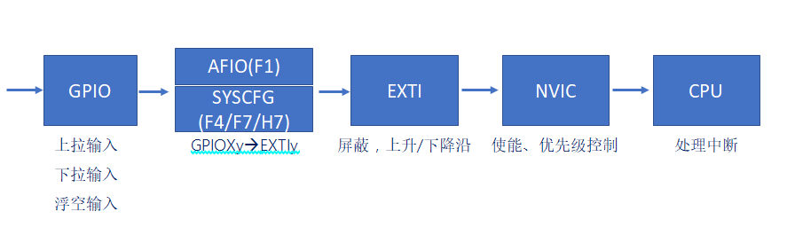

# 中断基础知识

## 1、什么是中断

答：打断CPU执行正常的程序，转而处理紧急程序，然后返回原暂停的程序继续运行，就叫中断。

## 2、中断的作用和意义

答：

- 实时控制：在确定时间内对相应事件作出响应，如：温度监控。
- 故障处理：检测到故障，需要第一时间处理，如：电梯门夹人了。
- 数据传输：不确定数据何时会来，如：串口数据接收。

中断的意义：高效处理紧急程序，不会一直占用CPU资源。

## 3、中断事例流程简图(外部中断)

答：

## 4、什么是NVIC

答：NVIC就是嵌套向量中断控制器，属于内核（M3/4/7）。NVIC支持256个中断（16内核 + 240外部），支持256个优先级，允许裁剪！

|  **STM32型号**  | **内核中断** | **外部中断** | **中断优先级** |
| :-------------: | :----------: | :----------: | :------------: |
| **STM32F103xx** |      10      |      60      |       16       |
| **STM32F407xx** |      10      |      82      |       16       |
| **STM32F429xx** |      10      |      91      |       16       |
| **STM32F750xx** |      10      |      98      |       16       |
| **STM32F767xx** |      10      |     110      |       16       |
| **STM32H743xx** |      10      |     150      |       16       |
| **STM32H750xx** |      10      |     150      |       16       |

简单点讲，NVIC就是专门控制中断的开关、中断的处理顺序的控制器。

## 5、什么是中断向量表

答：中断向量表就是一块以4字节对齐方式存放各个中断服务函数程序的首地址的固定内存区。

注意：中断向量表定义在启动文件，当发生中断，CPU会自动执行对应的中断服务函数。

## 6、NVIC寄存器介绍

答：

|            **NVIC相关寄存器**             | **位数** | **寄存器个数** |               **备注**                |
| :---------------------------------------: | :------: | :------------: | :-----------------------------------: |
|        **中断使能寄存器（ISER）**         |    32    |       8        |          每个位控制一个中断           |
|        **中断除能寄存器（ICER）**         |    32    |       8        |          每个位控制一个中断           |
| **应用程序中断及复位控制寄存器（AIRCR）** |    32    |       1        |        位[10:8]控制优先级分组         |
|        **中断优先级寄存器（IPR）**        |    8     |      240       | 8个位对应一个中断，而STM32只使用高4位 |

注意：NVIC还有中断挂起，解挂，激活标志等非常用功能。

## 7、NVIC工作原理

答：

## 8、什么是抢占优先级、什么是响应优先级、什么是自然优先级

答：

- 抢占优先级：高抢占优先级可以打断正在执行的低抢占优先级中断。
- 响应优先级：当抢占优先级相同时，响应优先级高的先执行，但是不能互相打断。
- 自然优先级：中断向量表的优先级。

注意：

- 数值越小，表示优先级越高。
- 抢占和响应都相同的情况下，自然优先级越高的，先执行。 

## 9、中断优先级分组(STM32F1)

答：

| **优先级分组** | **AIRCR[10:8]** | **IPRxbit[7:4]分配** |         **分配结果**         |
| :------------: | :-------------: | :------------------: | :--------------------------: |
|     **0**      |       111       |     None ：[7:4]     | 0位抢占优先级，4位响应优先级 |
|     **1**      |       110       |     [7] ：[6:4]      | 1位抢占优先级，3位响应优先级 |
|     **2**      |       101       |    [7:6] ：[5:4]     | 2位抢占优先级，2位响应优先级 |
|     **3**      |       100       |    [7:5]   ：[4]     | 3位抢占优先级，1位响应优先级 |
|     **4**      |       011       |     [7:4] ：None     | 4位抢占优先级，0位响应优先级 |

## 10、STM32中断优先级举例（假设分组是2）

答：

分组2为：2位抢占优先级，2位响应优先级。

| **编号** | **自然优先级** | **对应外设** | **抢占** | **响应** | **执行顺序** |
| :------: | :------------: | :----------: | :------: | :------: | :----------: |
|  **3**   |       10       |     RTC      |    2     |    1     |      2       |
|  **6**   |       13       |    EXTI0     |    3     |    0     |      4       |
|  **7**   |       14       |    EXTI1     |    2     |    0     |      1       |
|  **-1**  |       6        |   Systick    |    3     |    0     |      3       |

