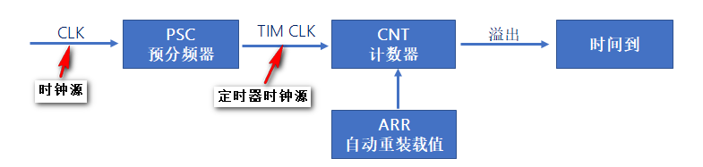
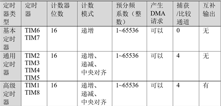
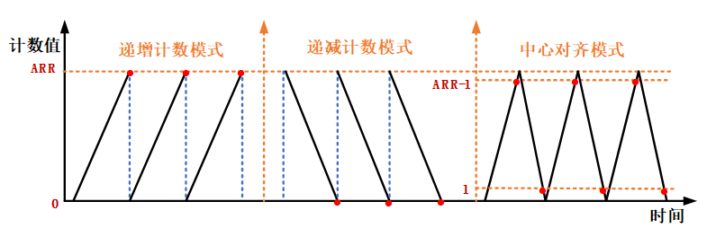
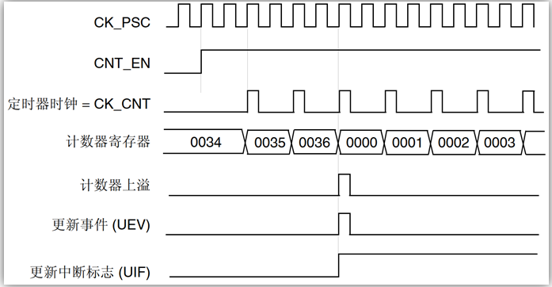
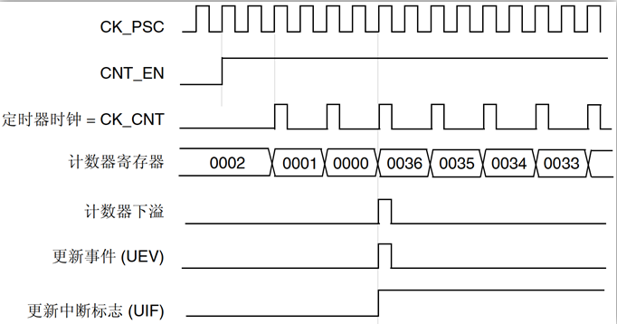
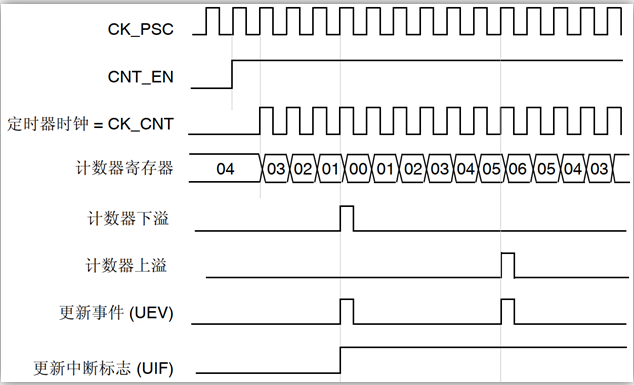

# 定时器基础知识1---定时器概述


## 1、软件定时原理

答：使用纯软件（CPU死等）的方式实现定时（延时）功能。

```C
/* 如下就是一个简单的软件定时(延时函数) */
void delay_us(uint32_t us)
{
    us *= 72;
    while(us--);
}
```

软件定时的缺点：

- 延时不精准。
- CPU死等，浪费CPU资源。


## 2、硬件定时器定时原理

答：使用精准的时基，通过硬件的方式，实现定时功能。

重点：定时器核心就是计数器。




## 3、STM32定时器分类

答：


## 4、STM32定时器特性表(STM32F1)

答：




## 5、STM32基本、通用、高级定时器的功能整体区别

答：

| **定时器类型** |                         **主要功能**                         |
| :------------: | :----------------------------------------------------------: |
| **基本定时器** |           没有输入输出通道，常用作时基，即定时功能           |
| **通用定时器** |   具有多路独立通道，可用于输入捕获/输出比较，也可用作时基    |
| **高级定时器** | 除具备通用定时器所有功能外，还具备带死区控制的互补信号输出、刹车输入等功能（可用于电机控制、数字电源设计等） |


## 6、STM32定时器计数模式及溢出条件

答：

|  **计数器模式**  |    **溢出条件**     |
| :--------------: | :-----------------: |
| **递增计数模式** |      CNT==ARR       |
| **递减计数模式** |       CNT==0        |
| **中心对齐模式** | CNT=\=ARR-1、CNT==1 |




**递增计数模式实例说明(PSC=1，ARR=36)：**




**递减计数模式实例说明(PSC=1，ARR=36)：**




**中心对齐模式实例说明(PSC=1，ARR=6)：**


