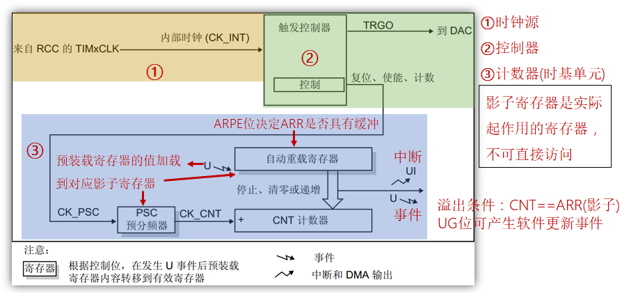
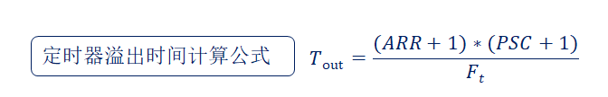

# 定时器基础知识2---基本定时器

## 1、基本定时器简介(STM32F1)

答：

**基础定时器**：TIM6 和 TIM7。

**主要特性**：

- 16位递增计数器（计数值：0~65535）。
- 16位预分频器（分频系数：1~65536）。
- 可用于触发DAC。
- 在更新事件（计数器溢出）时，会产生中断/DMA请求。

## 2、基本定时器框图(STM32F1)

答：

## 3、基本定时器的用途

答：基本定时器一般只用于做**定时工作**(如开启某个传感器1s后关闭)或者**周期性工作**(如每隔1s获取某个传感器数值)。

## 4、定时器溢出时间计算方法(STM32F1)

答：

- T~out~：是定时器溢出时间
- F~t~：是定时器的时钟源频率
- ARR：是自动重装载寄存器的值
- PSC：是预分频器寄存器的值

举个例子：**假设我们要设置一个500ms的定时器，时钟源频率是72Mhz，求ARR(预装载值)的值。**

- 1Mhz == 1 000 000hz
- 1s == 1 / 1 000 000hz

通过配置将PSC(预分频寄存器)设置为7199。

72Mhz == 72 000 000hz

500ms == 0.5s

带入公式可以得到

0.5 = ((ARR+1) * (7199+1)) / 72 000 000

最终结果 ARR = 4999