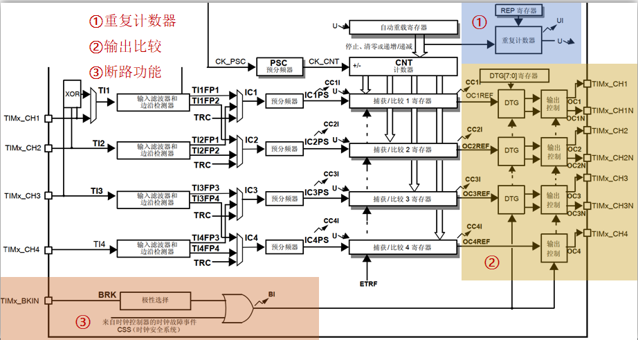
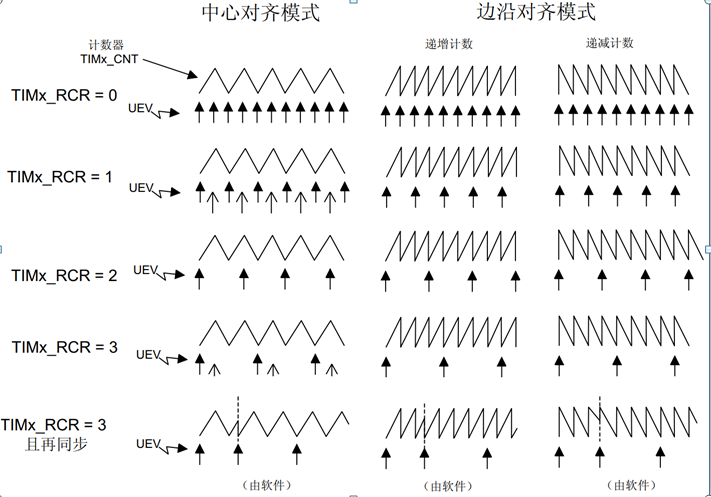

# 定时器基础知识4---高级定时器定时器

## 1、高级定时器简介(STM32F1)

答：

**通用定时器**：TIM1 和 TIM8。

**主要特性**：

- 16位递增、递减、中心对齐计数器（计数值：0~65535）。
- 16位预分频器（分频系数：1~65536）。
- 可用于触发DAC、ADC。
- 在更新事件、触发事件、输入捕获、输出比较时，会产生中断/DMA请求。
- 4个独立通道，可用于：输入捕获、输出比较、输出PWM、单脉冲模式。
- 使用外部信号控制定时器且可实现多个定时器互连的同步电路
- 支持编码器和霍尔传感器电路等
- 重复计数器
- 死区时间带可编程的互补输出
- 断路输入，用于将定时器的输出信号置于用户可选的安全配置中

## 2、通用定时器框图(STM32F1)

答：

注意：

- 高级定时器的时钟源和通用定时器的时钟源差不多，就不再描述。
- 高级定时器和通用定时器区别在于多了**重复计数器**、**死区时间带可编程的互补输出**、**断路输入**。

## 3、重复计数器的特性

答：计数器每次上溢或下溢都能使重复计数器减1，减到0时，再发生一次溢出就会产生更新事件。

注意：如果设置RCR为N，更新事件将在N+1次溢出时发生。