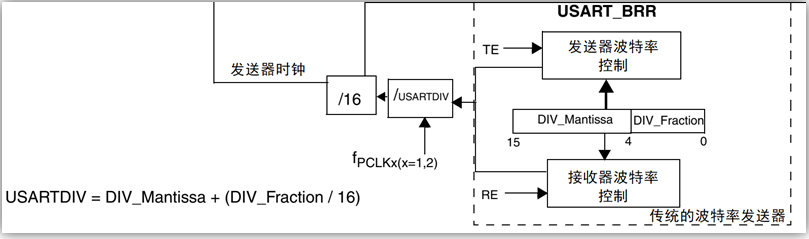

# 串口基础知识

## 1、什么是串口

答：串口是一种通过特定波特率按位发送和接收的**串行通信**接口。由一根**接收线**和一根**发送线**组成，两个串口通信设备间数据通过**特定的波特率**进行传输。

## 2、有哪些接口是属于串口

答：USART(同步/异步收发器)、UART(异步收发器)、RS232、RS485。

## 3、RS-232电平与COMS电平、TTL电平、RS-485电平对比 

答：

|    电平类型    |                     逻辑电压                      |
| :------------: | :-----------------------------------------------: |
| **RS-232电平** |      逻辑1：-15V ~ -3V    逻辑0：+3V ~ +15V       |
|  **COMS电平**  |          逻辑1：3.3V          逻辑0：0V           |
|  **TTL电平**   |          逻辑1：5V            逻辑0：0V           |
| **RS-485电平** | 逻辑1：2V<A端-B端<6V       逻辑0：-6V<A端-B端<-2V |

## 4、串口一帧数据组成？

答：串口的一帧数据是由  **起始位**+**数据位**+**校验位(可有可无)**+**停止位 ** 组成。

- 启动位        ：必须占1个位长，保持逻辑0电平。
- 有效数据位：可选5、6、7、8、9个位长，LSB在前，MSB在后 。
- 校验位        ：可选占1个位长，也可以没有该位。
- 停止位        ：必须有，可选占0.5、1、1.5、2个位长，保持逻辑1电平。

## 5、串口是先发高位还是先发低位

答：**先发低位后发高位**。

## 6、USART与UART的区别

答：区别在于USART是**同步异步收发器**，支持同步通信和异步通信，而UART是**异步收发器**，只支持异步通信。

## 7、UART波特率计算(STM32F1)

答：

$$
波特率计算公式：baud=\frac{F_{ck}}{16*USARTDIV}
$$
其中Fck是串口的时钟，如：USART1的时钟是PCLK2,其他串口都是PCLK1。