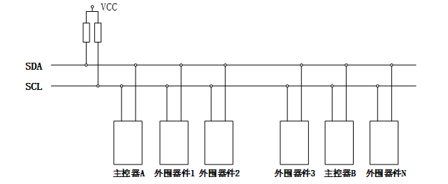
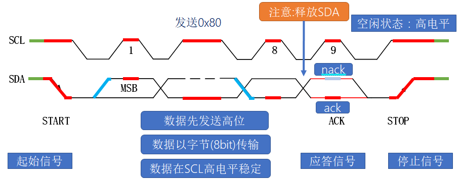

# IIC基础知识

## 1、什么是IIC

答：IIC 是一种**同步串行半双工**总线通信，由一根**时钟线**SCL 和一根**数据线**SDA 组成， IIC 的时序主要分为 5 个时序段，分别是**空闲段、起始段、数据段、应答段、停止段**；通过时钟线和数据线配合实现 IIC 时序从而完成对 IIC 总线上的从器件操作。

## 2、IIC总线结构图

答：

1. 由时钟线SCL和数据线SDA组成，并且都接上拉电阻，确保总线空闲状态为高电平。
2. 总线支持多设备连接，允许多主机存在，每个设备都有一个唯一的地址。
3. 连接到总线上的数目受总线的最大电容400pf限制。
4. 数据传输速率：标准模式100k bit/s 快速模式400k bit/s 高速模式3.4Mbit/s。

## 3、IIC协议时序

 答：

- 空闲段：数据线和时钟线都**保持高电平**。

- 起始段：**时钟线高电平**的情况下，**将数据线由高拉低**。

- 数据段：**时钟线为低电平时**，数据线变换电平；**时钟线高电平时**，数据线保持电平。

- 应答段：

    ​               应答    ：**时钟线为高电平**的情况下**数据线保持低电平**。

    ​               不应答：**时钟线为高电平**的情况下**数据线保持高电平**。

- 停止段：**时钟线高电平**的情况下，将**数据线由低拉高**。  

## 4、IIC可以挂载多少个不同地址器件？

答：理论上最多 127 个，而且这 127 个的器件地址必须是不一样的。

## 5、为什么是127个？

答：因为 IIC 通信的第一个字节数据就是**寻址数据**，寻址数据的**高 7 位是地址**，**最后一位是读写位**。

## 6、IIC是同步还是异步？

答：同步。

## 7、IIC有几根线？

答：两根线，一根时钟线，一根数据线。

## 8、IIC 通信时先发高位还是发送低位？

答：先发高位后发低位。

## 9、IIC的线路上为什么有接上拉电阻？

答：有助于IIC信号稳定，不易被干扰，同时保证空闲状态下IIC的数据线和时钟线保持高电平。

## 10、IIC总线上如何冲突？

答：

如果是一条总线上多个从设备之间冲突：解决办法就是保证每个从设备的设备地址不一样。

如果是一条总线上多个主设备之间冲突：

- 冲突情况1：A主设备正在用IIC总线，B主设备突然也想在IIC总线发数据。

    解决办法：就是主设备在使用IIC总线前反复检测几次IIC的时钟线和数据线是否处于高电平，如果是，表示IIC总线空闲，如果不是，表示IIC总线已经被占用。

- 冲突情况2：A主设备和B主设备同一时间同一时刻使用IIC总线发数据。

    解决办法：主设备每发1bit(一位)数据时，检测数据线的电平信号是否和自己发的那1bit(一位)数据相同，如果相同继续发，如果不同表示IIC使用权被其他主设备占用。