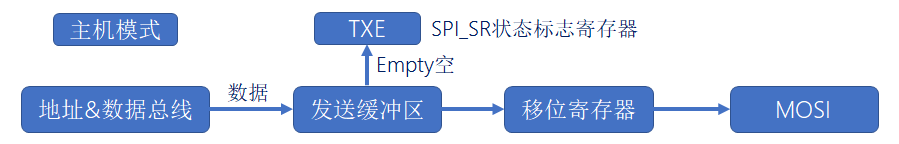
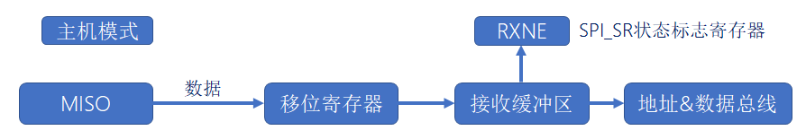
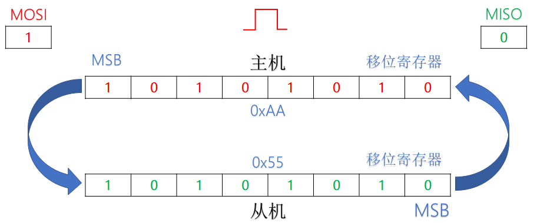
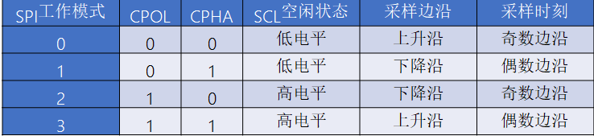

# SPI基础知识

## 1、什么是SPI？

答：SPI 是一种高速的**同步串行全双工**的总线通信，一般由**四条通信线**组成，分别是**时钟线**SCLK、**片选线**CS、**数据输入线**MISO、**数据输出线**MOSI。 SPI 时序一般分为**四种操作模式**，而这些模式是依据**时钟相位**和**时钟极性**划分的。

## 2、SPI是同步还是异步

答：同步。

## 3、SPI有几根线？

答：四根线，一根时钟线，一根片选线，一根主输出线，一根主输入线。

## 4、SPI 通信时先发高位还是发送低位？

答：SPI 可以先发高位，也可以先发低位。

## 5、SPI的数据发送与接收

答：

数据发送：

数据接收：

## 6、SPI工作原理

答：

- 主机只向从机进行写操作，可以忽略接收到的从机数据。
- 主机要对从机进行读操作，需要发送一个空数据来引发从机发送数据。 

## 7、什么是时钟相位，什么是时钟极性？

答：

- 时钟极性：没有数据传输时时钟线的空闲状态电平。

    ​                0：SCK在空闲状态保持低电平

    ​                1：SCK在空闲状态保持高电平

- 时钟相位：决定了时钟线在第一个跳边沿还是第二个跳边沿时，进行数据线读取或写入数据。

    ​                0：SCK的第一(奇数)边沿进行数据位采样，数据在第一个时钟边沿被锁存

    ​                1：SCK的第二(偶数)边沿进行数据位采样，数据在第二个时钟边沿被锁存

    

## 8、SPI与IIC的区别

答：

| **功能说明** |     **SPI总线**     |      **IIC总线**       |
| :----------: | :-----------------: | :--------------------: |
| **通信方式** |  同步 串行 全双工   |    同步 串行 半双工    |
| **总线接口** | MOSI、MISO、SCL、CS |        SDA、SCL        |
| **拓扑结构** |  一主多从/一主一从  |         多主从         |
| **从机选择** |    片选引脚选择     |   SDA上设备地址片选    |
| **通信速率** |    一般50MHz以下    | 100kHz、400kHz、3.4MHz |
| **数据格式** |      8位/16位       |          8位           |
| **传输顺序** |       MSB/LSB       |          MSB           |

## 9、硬件SPI和模拟SPI的区别？

答：区别在于**效率**和**移植性**，硬件 SPI 移植差，但传输效率高；模拟 SPI 移植性高，但传输效率低。 
