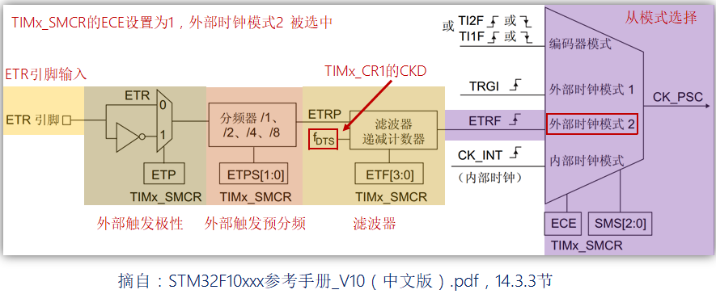

# 定时器基础知识3---通用定时器

## 1、通用定时器简介(STM32F1)

答：

**通用定时器**：TIM2、TIM3、TIM4、TIM5。

**主要特性**：

- 16位递增、递减、中心对齐计数器（计数值：0~65535）。
- 16位预分频器（分频系数：1~65536。
- 可用于触发DAC、ADC。
- 在更新事件、触发事件、输入捕获、输出比较时，会产生中断/DMA请求。
- 4个独立通道，可用于：输入捕获、输出比较、输出PWM、单脉冲模式。
- 可以使用外部信号控制定时器且可实现多个定时器互连的同步电路。
- 支持编码器和霍尔传感器电路等。

## 2、通用定时器框图(STM32F1)

答：

## 3、通用定时器时钟源(STM32F1)

答：

- ①内部时钟(CK_INT)，来自外设总线APB提供的时钟。
- ②外部时钟模式1：外部输入引脚(TIx)，来自定时器通道1或者通道2引脚的信号(就是从捕获通道得到时钟信号)。
- ③外部时钟模式2：外部触发输入(ETR)，来自可以复用为TIMx_ETR的IO引脚(就是从特定的外部引脚获取时钟信号)。
- ④内部触发输入(ITRx)，用于与芯片内部其它通用/高级定时器级联(以其他定时作为时钟信号源)。

## 4、外部时钟模式1

答：

## 5、外部触发模式2

答：

## 6、使用一个定时器作为另一个定时器的预分频器(STM32F1)

答：

