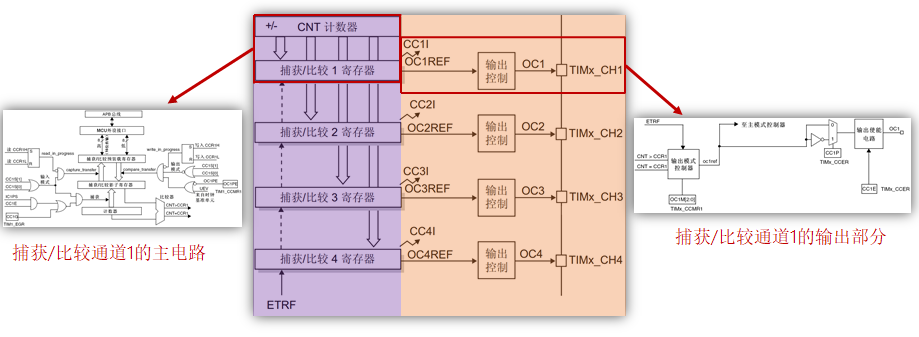
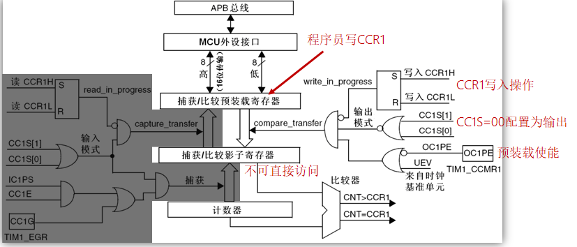
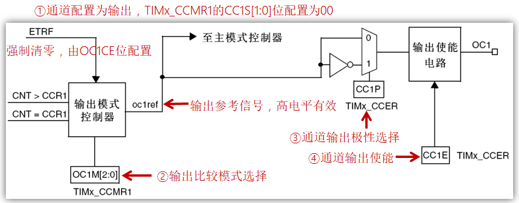
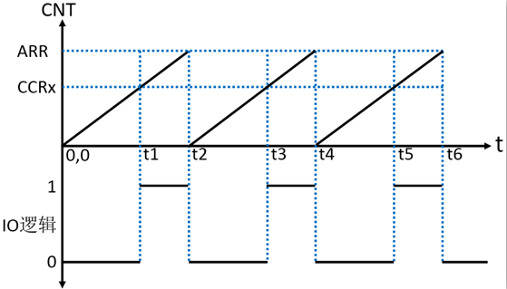
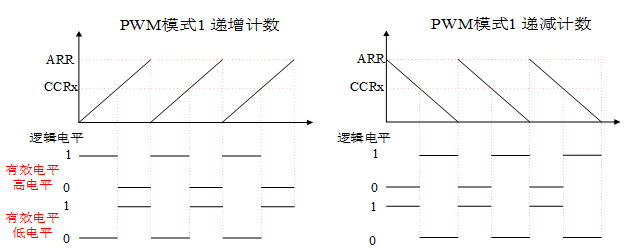
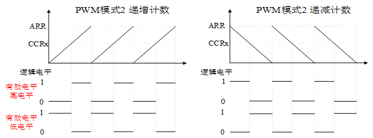
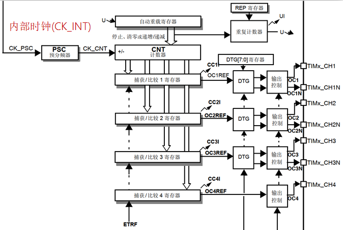

# PWM基础知识

## 1、通用定时器输出比较部分(PWM输出)框图介绍(STM32F1)

答：

输出比较部分总框架图：

捕获/比较通道1的主电路(输出部分)：

注意：灰色部分是捕获功能的，这里PWM只需关注非灰色部分的。

捕获/比较通道的输出部分(通道1)：

## 2、通用定时器输出PWM原理

答：

假设：递增计数模式

- ARR：自动重装载寄存器的值。
- CCRx：捕获/比较寄存器x的值。

PWM过程：

- 当CNT < CCRx，IO输出0。
- 当CNT >= CCRx，IO输出1。

总结：PWM波周期或频率由ARR决定，PWM波占空比由CCRx决定。

## 3、PWM模式(PWM有两种模式)

答：

PWM模式1：

递增计数：

- CNT < CCRx，输出有效电平。
- CNT >= CCRx，输出无效电平。

递减计数：

- CNT > CCRx，输出无效电平。
- CNT <= CCRx，输出有效电平。

PWM模式2：

递增计数：

- CNT < CCRx，输出无效电平。
- CNT >= CCRx，输出有效电平。

递减计数：

- CNT > CCRx，输出有效电平。
- CNT <= CCRx，输出无效电平。

注意：有/无效状态由TIMx_CCER决定

- CCxP=0：OCx高电平有效。
- CCxP=1：Ocx低电平有效。

总结：PWM模式其实就是决定定时器计数值(CNT)小于CCRx时是输出有效电平还是无效电平。

## 4、高级定时器输出指定个数PWM实验原理

答：主要是利用了高级定时器的重复计数器的特性，在重复计数器更新中断中关闭定时器的原理。

1. 配置边沿对齐模式输出PWM。
2. 指定输出N个PWM，则把N-1写入RCR。
3. 在更新中断内，关闭计数器。

注意：高级定时器通道输出必须把MOE位置1。
