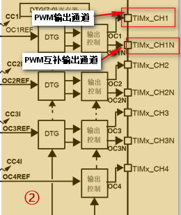
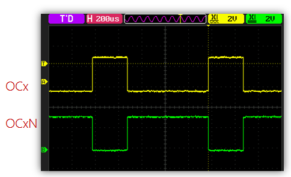
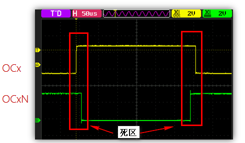
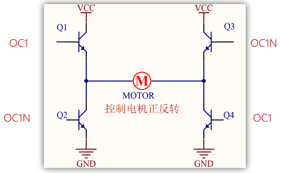
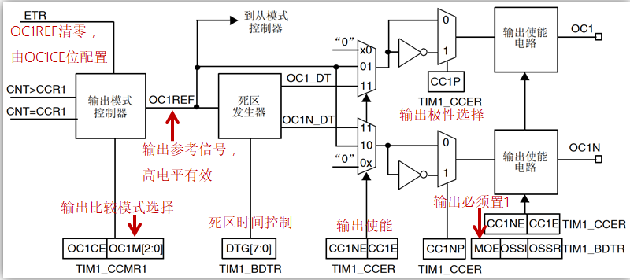
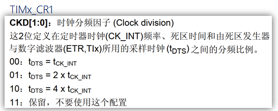
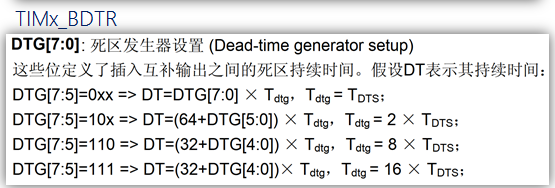
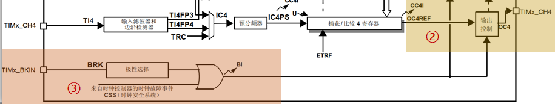

# PWM互补输出、死区和刹车

## 1、什么是PWM互补输出

答：PWM互补输出顾名思义就是**PWM通道**和**PWM互补通道**输出两个高低电平相反的PWM。

注意：PWM互补输出功能只有高级定时器才有。

## 2、什么是死区

答：PWM互补输出中，PWM周期中故意留出一小部分时间段让**PWM通道**和**PWM互补通道**同处相同电平状态，同处在相同电平状态的区域就叫做死区。

## 3、带死区控制的互补输出应用之H桥

答：死区的运用最常见的就是控制电机的正反转方向(H桥)。

图中H桥的Q1和Q2或Q3和Q4不能同时导通，即PWM输出通道(OC)和PWM互补输出通道不能同时高电平，但**由于元器件是有延迟特性，所以需要加上死区时间控制**。

## 4、捕获/比较通道的输出部分（通道1至3）

答：

## 5、死区时间计算

答：

1. 确定tDTS的值。
2. 判断DTG[7:5]，选择计算公式。
3. 代入选择的公式计算。

$$
𝑓_{𝐷𝑇𝑆}=\frac{F_t}{2^{𝐶𝐾𝐷[1:0]}}
\\
t_{DTS}=\frac{1}{𝑓_{𝐷𝑇𝑆}}
\\
t_{DTS}=\frac{2^{𝐶𝐾𝐷[1:0]}}{F_t}
$$

**举例假设：使用STM32F103，定时器时钟频率Ft为72Mhz，CKD[1:0]设置为2(二进制为10)，DTG[7:0]设置为250(二进制为1111 1010)。**

72Mhz = 72 000 000hz

1s = 1 000 000 000ns

1us = 1 000ns

tDTS  =  22/72 000 000  =  0.000 000 005 5555......s = 5.56ns

Tdtg = 16 X tDTS> = 16 X 5.56 ns

死区持续时间 = （32+26）X 16 X 5.56ns = 5.159 68 us

## 6、刹车功能

答：刹车功能就是TIMx_BKIN引脚受到有效电平后关闭PWM的输出通道(关掉PWM)。

使能刹车功能：将TIMx_BDTR的BKE位置1，刹车输入信号极性由BKP位设置。

使能刹车功能后：由TIMx_BDTR的MOE、OSSI、OSSR位，TIMx_CR2的OISx、OISxN位，TIMx_CCER的CCxE、CCxNE位控制OCx和OCxN输出状态。

注意：无论何时，OCx和OCxN输出都不能同时处在有效电平。

## 7、发生刹车后，会怎么样

答：

1. MOE位被清零，OCx和OCxN为无效、空闲或复位状态(OSSI位选择)。
2.  OCx和OCxN的状态：由相关控制位状态决定，当使用互补输出时：根据情况自动控制输出电平，参考参考手册使用刹车(断路)功能小节。
3. BIF位置1，如果使能了BIE位，还会产生刹车中断；如果使能了TDE位，会产生DMA请求。
4. 如果AOE位置 1，在下一个 更新事件UEV时，MOE位被自动置 1。
