# ADC基础知识


## 1、什么是ADC

答：ADC，全称：Analog-to-Digital Converter，指模拟/数字转换器。即专门将模拟信号转化为数字信号的转换器。

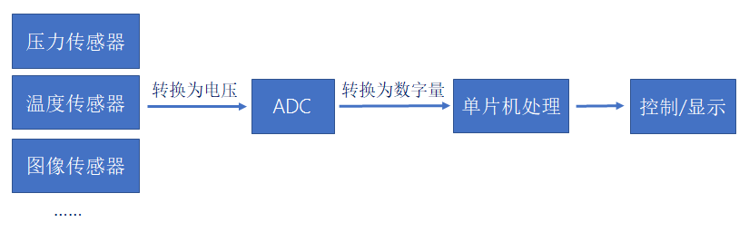


## 2、并联比较型工作示意图

答：

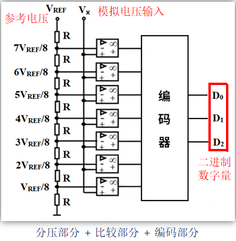

- 优点：转换速度快。
- 缺点：成本高、功耗高、分辨率低。


## 3、逐次逼近型工作示意图

答：

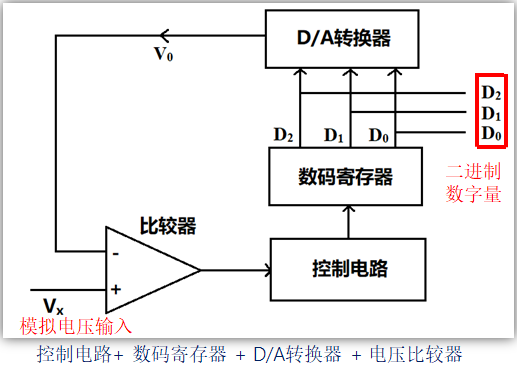

- 优点：结构简单、低功耗。
- 缺点：转换速度较慢。

特点：分辨率和采样速度相互矛盾，分辨率越高，采样速率越低。

注意：大部分单片机ADC使用的就是逐渐逼近型。


## 4、并联比较型和逐次逼近型对比

答：

| **ADC电路类型** |     **优点**     |         **缺点**         |
| :-------------: | :--------------: | :----------------------: |
| **并联比较型**  |   转换速度最快   | 成本高、功耗高，分辨率低 |
| **逐次逼近型**  | 结构简单，功耗低 |       转换速度较慢       |


## 5、ADC的特性参数

答：

- 分辨率：表示ADC能辨别的最小模拟量，用二进制位数表示，比如：8、10、12、16位等。
- 转换时间：表示完成一次A/D转换所需要的时间，转换时间越短，采样率就可以越高。
- 精度：最小刻度基础上叠加各种误差的参数，精度受ADC性能、温度和气压等影响。
- 量化误差：用数字量近似表示模拟量，采用四舍五入原则，此过程产生的误差为量化误差。


## 6、ADC框图简介(STM32F1)

答：

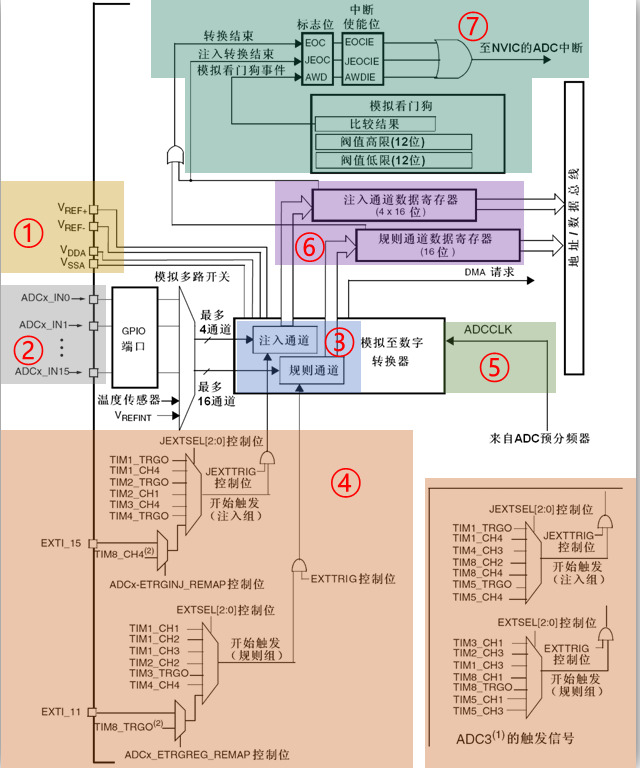

- ①参考电压/模拟部分电压(ADC供电电压)
- ②输入通道
- ③转换序列
- ④触发源
- ⑤转换时间
- ⑥数据寄存器
- ⑦中断


## 7、参考电压/模拟部分电压(ADC供电电压)

答：

模拟部分电源：

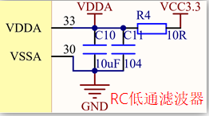

注意：ADC供电电源：VSSA、 VDDA （2.4V≤VDDA≤3.6V ）。


参考电压：

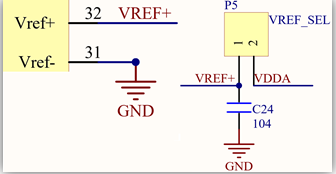

注意：ADC输入电压范围：VREF–≤VIN≤VREF+（即0V≤VIN≤3.3V ）。


## 8、ADC转换序列(STM32F1)

答：转换序列说直白点就是ADC通道转换顺序的列表，A/D转换被组织为两组：规则组（常规转换组）和注入组（注入转换组）。

注意：规则组最多可以有16个转换，注入组最多有4个转换。

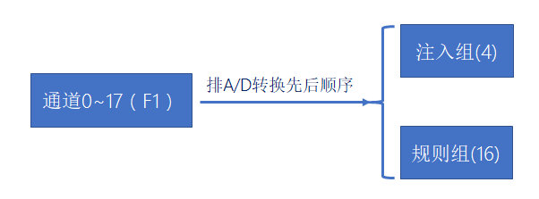

- 规则组：类似ADC通道优先级，被设置为第1规则组的ADC通道最先进行ADC转换，紧接着第2规则组的ADC通道转换，按顺序以此类推。
- 注入组：有点类似我们生活中遇到的插队现象，可以对规则组顺序转换中进行插队。例如，当第1规则组转换完成后应该轮到第2规则组进行ADC转换，这个时候突然注入组需要转换，那么注入组就可以插队到第2规则组之前转换。


## 9、规则组和注入组执行优先级对比

答：

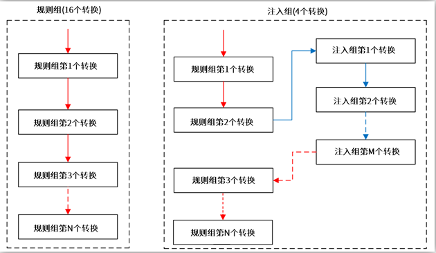


## 10、ADC触发源

答：

触发转换的方法有两种：

1. ADON位触发转换(仅限F1系列)：

    当ADC_CR2寄存器的ADON位为1时，再单独给ADON位写1，只能启动规则组转换。

2. 外部事件触发转换：

    外部事件触发转换分为：规则组外部触发和注入组外部触发。


规则组外部触发使用方法：

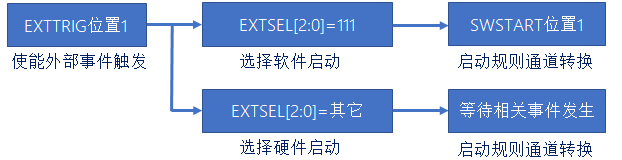

注入组外部触发使用方法：

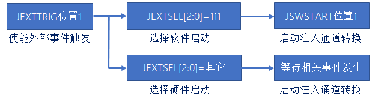


## 11、ADC时钟源(STM32F1)

答：

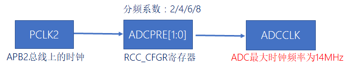

以STM32F1为例，ADC是在APB2总线上，APB2时钟频率是72Mhz，ADC最大频率不能超过14Mhz，所以STM32F1的ADC时钟源最大频率是12Mhz。

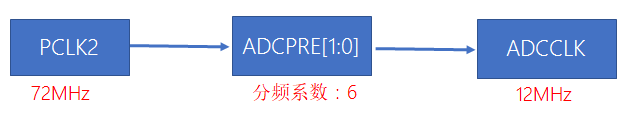


## 12、如何计算ADC转换时间

答：

ADC转换时间： 
$$
T_{CONV}(转换时间) = 采样时间 + 12.5个周期
$$
采样时间可通过SMPx[2:0]位设置，x=0~17

| **SMP = 000：1.5个ADC时钟周期**  | **SMP = 100：41.5个ADC时钟周期**  |
| :------------------------------: | :-------------------------------: |
| **SMP = 001：7.5个ADC时钟周期**  | **SMP = 101：55.5个ADC时钟周期**  |
| **SMP = 010：13.5个ADC时钟周期** | **SMP = 110：71.5个ADC时钟周期**  |
| **SMP = 011：28.5个ADC时钟周期** | **SMP = 111：239.5个ADC时钟周期** |


举个例子：ADC时钟频率为12MHz时，SMP[2:0]设置为000，ADC转换时间是多少？

```
T_{CONV}(转换时间) = 采样时间 + 12.5个周期
                  = 1.5个周期 + 12.5个周期 
                  = 14个周期 
                  = (1/12000000)*14 s 
                  = 1.17us
```


## 13、ADC数据寄存器

答：

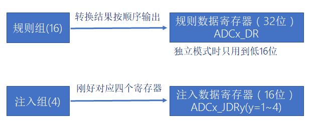

由ADCx_CR2寄存器的ALIGN位设置数据对齐方式，可选择：右对齐或者左对齐。


## 14、ADC中断

答：

|        **中断事件**        | **事件标志** | **使能控制位** |
| :------------------------: | :----------: | :------------: |
|    **规则通道转换结束**    |     EOC      |     EOCIE      |
|    **注入通道转换结束**    |     JEOC     |     JEOCIE     |
| **设置了模拟看门狗状态位** |     AWD      |     AWDIE      |
|     **溢出（F1没有）**     |     OVR      |     OVRIE      |

DMA请求（只适用于规则组）：规则组每个通道转换结束后，除了可以产生中断外，还可以产生DMA请求，我们利用DMA及时把转换好的数据传输到指定的内存里，防止数据被覆盖。


## 15、单次转换模式和连续转换模式

答：

|  **CONT位**  |    **0**     |    **1**     |
| :----------: | :----------: | :----------: |
| **转换模式** | 单次转换模式 | 连续转换模式 |

| **转换组/转换模式** |               **单次转换模式(只触发一次转换)**               | **连续转换模式(自动触发下一次转换)  注意：只有规则组才能触发该模式** |
| :-----------------: | :----------------------------------------------------------: | :----------------------------------------------------------: |
|     **规则组**      | 转换结果被储存在ADC_DR    EOC（转换结束）标志位被置1  如果设置了EOCIE位，则产生中断  然后ADC停止 | 转换结果被储存在ADC_DR    EOC（转换结束）标志位被置1  如果设置了EOCIE位，则产生中断 |
|     **注入组**      | 转换结果被储存在ADC_DRJx  JEOC（转换结束）标志位被置1  如果设置了JEOCIE位，则产生中断  然后ADC停止 | 转换结果被储存在ADC_DRJx  JEOC（转换结束）标志位被置1  如果设置了JEOCIE位，则产生中断  自动注入：将JAUTO位置1 |


## 16、扫描模式

答：

|  **SCAN位**  |    **0**     |    **1**     |
| :----------: | :----------: | :----------: |
| **扫描模式** | 关闭扫描模式 | 使用扫描模式 |


|                  **关闭扫描模式**                   |                **使用扫描模式**                 |
| :-------------------------------------------------: | :---------------------------------------------: |
| ADC只转换ADC_SQRx或ADC_JSQR选中的第一个通道进行转换 | ADC会扫描所有被ADC_SQRx或ADC_JSQR选中的所有通道 |


## 17、不同模式组合的作用

答：

| **单次转换模式（不扫描）** |         只转换一个通道，而且是一次，需等待下一次触发         |
| :------------------------: | :----------------------------------------------------------: |
|  **单次转换模式（扫描）**  |       **ADC_SQRx 和ADC_JSQR 选中的所有通道都转换一次**       |
| **连续转换模式（不扫描）** |      **只会转换一个通道，转换完后会自动执行下一次转换**      |
|  **连续转换模式（扫描）**  | **ADC_SQRx 和ADC_JSQR 选中的所有通道都转换一次，并自动进入下一轮转换** |


具体例子：

| **单次转换模式（不扫描）** |            **使用ADC单通道，并要求进行一次转换**             |
| :------------------------: | :----------------------------------------------------------: |
|  **单次转换模式（扫描）**  |      **使用ADC多通道，并要求所有通道都转换一次就停止**       |
| **连续转换模式（不扫描）** |          **使用ADC单通道，并要求对该通道连续转换**           |
|  **连续转换模式（扫描）**  | **使用ADC多通道，并要求所有通道都转换一次后，自动启动下一轮转换** |

注意：有一种比较少用的模式：不连续采样模式（F1手册称为：间断模式），只适用在扫描模式下。


## 18、如何用过采样和求均值的方式提高ADC的分辨率？

答：

根据要增加的分辨率位数计算过采样频率方程：
$$
f_{os} = 4^w * f_s
$$
f<sub>os</sub>是过采样频率，w是希望增加的分辨率位数，f<sub>s</sub> 是初始采样频率要求。


```markdown
举个例子：12位分辨率的ADC提高4位分辨率，我们要使12位分辨率ADC通过软件实现16位辨率的ADC的效果。

要求可知ADC分辨率要提高4位，根据公式可以要进行256(4的4次方次)12位分辨ADC转换才能得到16位分辨率的值。
然后将这256次采集结果求和，求和的结果再右移4位，就得到提高分辨率后的结果。
注意：提高N 位分辨率，需要 右移N位。
```

