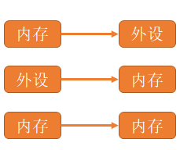
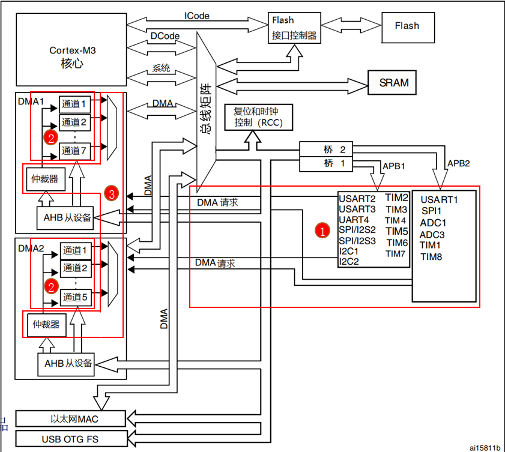
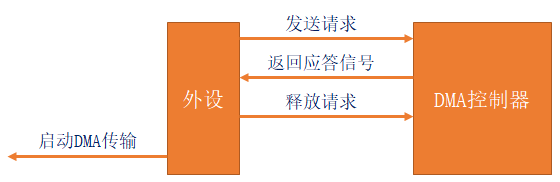
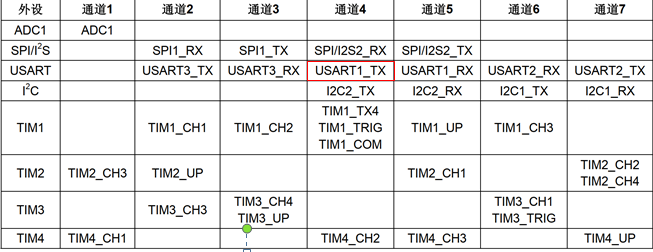
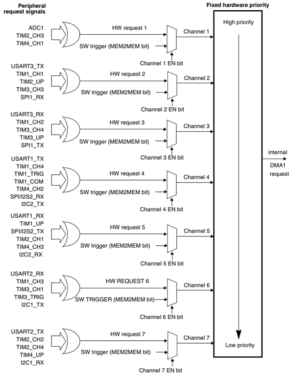

# DMA基础知识

## 1、什么是DMA，有什么作用

答：DMA，全称Direct Memory Access，即直接存储器访问。

DMA传输能够将数据从一个地址空间复制到另一个地址空间。DMA传输无需CPU直接控制传输，也没有中断处理方式那样保留现场和恢复现场过程，通过硬件为RAM和IO设备开辟一条直接传输数据的通道，使得CPU的效率大大提高。

总结：DMA可以理解为内存与外设间的桥梁，使内存和外设连通，DMA替代CPU来搬运数据。

## 2、DAM框架

答：

- ①DMA请求：DMA传输数据，先向DMA控制器发送请求。
- ②DMA通道：不同外设向DMA的不同通道发送请求，DMA1有7个通道，DMA2有5个通道。
- ③DMA优先级：多个DMA通道同时发来请求时，就有先后响应处理的顺序问题，这个由仲裁器管理（优先级管理也分软件阶段和硬件阶段）。

注意：DMA2仅存在大容量产品和互联型产品。

## 3、DMA处理过程

答：

1. 外设想通过DMA发送数据，先发送请求。
2. DMA控制器收到请求后，给外设一个ack(应答)。
3. 外设收到ack后，释放请求。
4. 外设启动DMA数据传输，直至传输结束。

## 4、DMA通道(STM32F1)

答：

每个通道用来管理来自于一个或多个外设对存储器访问的请求。且都有一个仲裁器，用于处理DMA请求间的优先级。

## 5、DMA优先级(STM32F1)

答：

仲裁器管理DMA通道请求分为两个阶段：软件阶段、硬件阶段。

- 第一阶段（软件阶段）：每个通道的优先级可在DMA_CCRx寄存器中设置，有四个等级：最高、高、中和低优先级。
- 第二阶段（硬件阶段）：如果两个请求有相同软件优先级，较低编号的通道比较高编号的通道有较高的优先级。

注意：

- 大容量芯片中，DMA1控制器拥有高于DMA2控制器的优先级。
- 多个请求通过逻辑或输入到DMA控制器，只能有一个请求有效。

