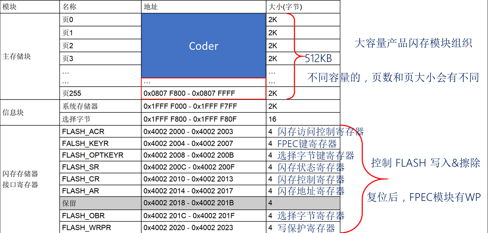
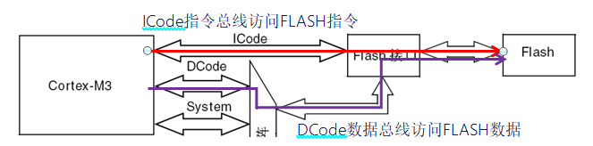
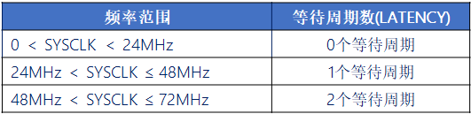
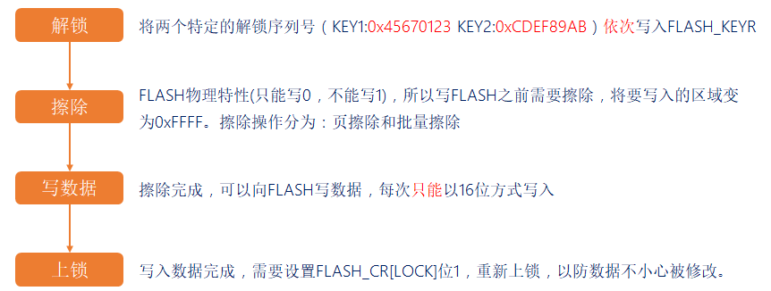
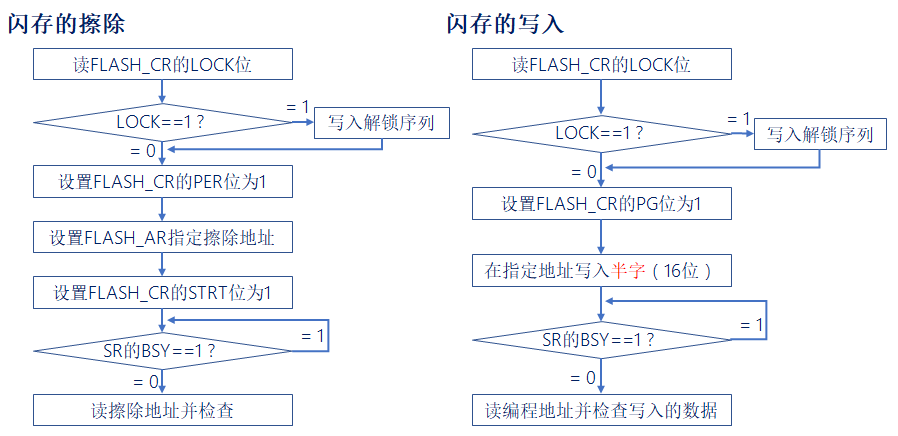

# 内部FLASH基础知识


## 1、内部FLASH和外部FLASH

答：

- 内部FLASH 用于保存要运行的代码和常量，其容量相对较小，但操作效率快，成本低。
- 外部FLASH 用于存储需要掉电保存的用户数据，其容量相对较大，但操作效率慢，成本高。


## 2、内部FLASH构成(STM32F1)

答：内部FLASH主要由三部分组成：**主存储器**、**信息块**、**闪存存储器接口寄存器**。

|   **闪存模块的子部分**   |                           **作用**                           |
| :----------------------: | :----------------------------------------------------------: |
|       **主存储器**       |        用来存放代码和数据常数（如const类型到的数据）         |
|        **信息块**        | 分为两个部分：系统存储（启动程序代码）、选项字节（用户选择字节） |
| **闪存存储器接口寄存器** |         用于控制闪存读写等，是整个闪存模块的控制结构         |

- 主存储器：地址范围为0x0800 0000 ~ 0x0807 FFFF，分为256页，每页2KB（小/中容量为1K）。当BOOT0接地，系统将从0x0800 0000地址处开始读取代码（从主存储器启动）。
- 信息块：系统存储大小为2KB，用来存储ST自带的启动程序，用来串口下载代码。选项字节大小为16B，一般用于设置内存的写保护、读保护。当BOOT0接VCC，BOOT1接GND （串口下载程序） ，系统运行的就是这部分代码。




## 3、FLASH读写过程(STM32F1)

答：对FLASH的核心操作就是读和写。

FLASH的物理特性：只能写0，不能写1，写1靠擦除。

**闪存的读取：**

直接在通用地址空间直接寻址，任何32位数据的读操作都能访问闪存模块的内容并得到相对应的数据。



CPU运行速度比FLASH快得多，STM32F103的FLASH最快访问速度≤24MHz，CPU频率超过这个速度，得加入等待时间，否则读写FLASH可能出错，导致死机等情况。



注意：一般除非CPU运行特别特别快，才需要我们关注等待周期，几个等待周期的我们就不需要理会，直接地址访问就行。

从地址addr，读取数据（字节为8位，半字为16位，字为32位）：

```c
data = *(volatile uint8_t *)addr;		/* 读取一个字节数据 */
data = *(volatile uint16_t *)addr;		/* 读取一个半字数据 */
data = *(volatile uint32_t *)addr;		/* 读取一个字数据 */
```

将addr强制转换为uintx_t指针，然后取该指针所指向地址的值，即可获得addr地址的数据。

注意： 在进行写或擦除操作时，不能进行代码或数据的读取操作。


**闪存的写入：**

闪存编程是由FPEC（闪存编程和擦除控制器）模块处理的。

写操作有四步：解锁 ---> 擦除 ---> 写数据 ---> 上锁



