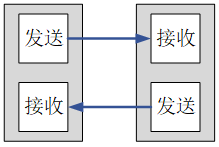
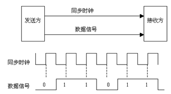

# 数据通信基础知识

## 1、串行/并行通信

答：

- 串行通信：数据朱位按顺序传输。
- 并航通信：数据各个位通过多条线同时传输。

串行通信：

并行通信：

## 2、串行通信与并行通信比较

答：

|     类型     | 传输速率 | 抗干扰能力 | 通信距离 | IO资源占用 | 成本 |
| :----------: | :------: | :--------: | :------: | :--------: | :--: |
| **串行通信** |   较低   |    较强    |   较长   |    较少    | 较低 |
| **并行通信** |   较高   |    较弱    |   较短   |    较多    | 较高 |

## 3、单工/半双工/全双工通信

答：

- 单工通信：数据只能沿一个方向传输。(类似收音机)
- 半双工通信：数据可以沿两个方向传输，但同一时刻中能沿一个方向。(类似对讲机)
- 全双工通信：数据可以同时进行双向传输。(类似电话)

单工通信：

半双工通信：

全双工通信：

## 4、同步/异步通信

答：

- 同步通信：需要时钟信号来协助传输数据。
- 异步通信：不需要时钟信号，通过在数据信号中加入起始位和停止位等一些同步信号来协助传输。

同步通信与异步通信区别就是在于有没有时钟线。

同步通信：

异步通信：

## 5、什么是波特率，什么是比特率

答：

- 比特率：每秒钟传送的比特数，单位 bit/s。
- 波特率：每秒钟传送的码元数，单位 Baud。
- 比特率 = 波特率 * log2 M ， M 表示每个码元承载的信息量，码元可以是1bit，也可以使2bit.......

二进制系统中，波特率数值上等于比特率。

## 6、常见的串行通信接口

答：

|          通信接口          |                           接口引脚                           | 数据同步方式 | 数据传输方向 |
| :------------------------: | :----------------------------------------------------------: | :----------: | :----------: |
| **UART  (通用异步收发器)** |              TXD:发送端  RXD:接收端  GND:公共地              |   异步通信   |    全双工    |
|         **1-wire**         |                        DQ:发送/接收端                        |   异步通信   |    半双工    |
|          **IIC**           |              SCL:同步时钟  SDA:数据输入/输出端               |   同步通信   |    半双工    |
|          **SPI**           | SCK:同步时钟  MISO:主机输入，从机输出  MOSI:主机输出，从机输入  CS:片选信号 |   同步通信   |    全双工    |

